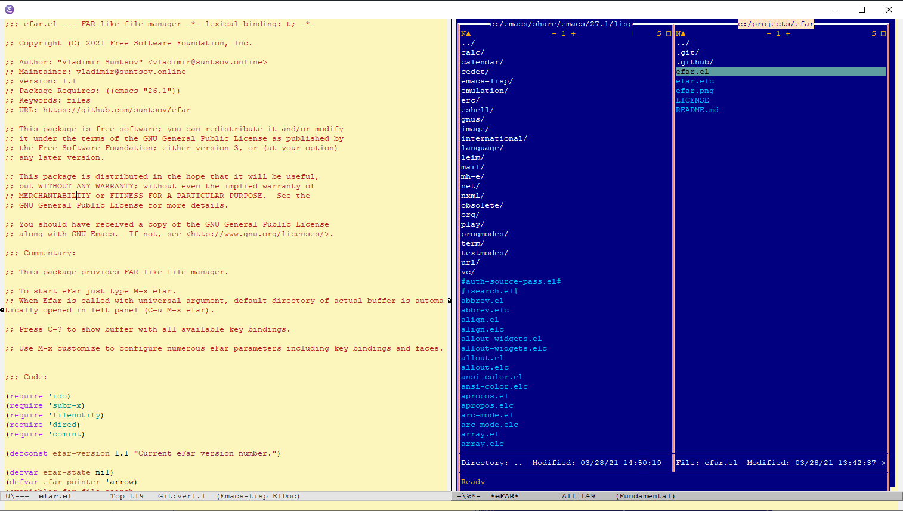

# eFar

This package provides FAR-like file manager for Emacs.

## Usage
Package is not available in MELPA yet (there is a plan to publish it in nearest future, though).

To start eFar just load file efar.el and type **M-x efar**.

When Efar is called with universal argument, default-directory of actual buffer is automatically opened in left panel - **C-u M-x efar**.

## Requirements
* Emacs 26.1 or newer.

## What's new in version 1.1
* mouse interaction 

## Features

### Navigation
* move cursor - **\<up\>, \<down\>, \<left\>, \<right\>**
* go to first/last file in current directory - **\<home\>/\<end\> or \<C-left\>/\<C-right\>**
* enter directory under cursor - **RET**
* switch to other panel - **TAB**
* open current directory in other panel - **C-c TAB**
* fast navigation to the file with specific name in current directory - **just start typing any part of file name**
* you also can include \'*\' into the search string, then search string is used as a wildcard
* **C-s/C-r** to go to next/previous occurrence, **C-g** to quit fast search mode
* go to the given directory - **C-c c d**
* go to the parent directory - **\<C-up\>**

### Appearance
* change mode double-panel <-> single-panel - **C-c v M**
* change number of columns in current panel - **C-c v +   or   C-c v -**
* change file display mode (short, long, detailed, full) - **C-c v m**

### Selecting disks (Windows) or mount points (Unix)
* display list of available disks (Windows) or mount points (Unix) - **C-c f d**

### Edit and auto preview
* open file under cursor in other buffer and switch to that buffer - **\<f4\>**
* open file under cursor in other buffer and keep eFar buffer actual - **\<f3\>**
* open file under cursor in external application - **\<M-f4\>**
* directories and files of predefined types are automatically opened in other buffer when navigating through the file list - this function can configured via customization
 
### File operations
* mark file under cursor - **\<insert\>**
* unmark all marked files - **\<C-insert\>**
* copy marked files (or file under cursor if no files marked) - **\<f5\>**
* move marked files (or file under cursor if no files marked) - **\<f6\>**
* delete marked files (or file under cursor if no files marked) - **\<f8\>**
* create new directory - **\<f7\>**
* create new file - **C-x C-f**
* show statistic (size, number of file and directories) for the directory under cursor - **C-c c s**
* run ediff for selected files - **C-c c e**
* copy to the clipboard path to the file under cursor - **C-c c p**

### Changing sort order, filtering
* change sort order and direction - **C-c f s**
* set/remove filtering by file mask - **C-c f f**

### File search
* start search in current directory - **\<M-f7\>**
* display last search results - **\<S-f7\>**
* go to the file from search result list - **RET**
* show buffer with detailed search results - **\<C-M-f7\>**
* it's possible to search for text in files using simple string or Emacs regular expressions
* when opening file from the file search results an incremental search is automatically activated for the searched text
* no external tools used for search functionality, it's completely implemented using pure elisp
* multiprocessing used when searching for text inside files

### Last visited directories
* display list of last visited directories - **C-c c h**
* go to the directory from the list of last visited directories - **RET**
* when panel is in file mode you can loop over last visited directories by **\<C-M-up\>** and **\<C-M-down\>**

### Panel mode selector
* Selector of available panel modes can be displayed by **C-c c m**
* Current panel is switched to selected mode

### Bookmarks
* add file/directory under cursor to bookmark list - **C-c c B**
* display bookmarks - **C-c c b**
* remove item from the list of bookmarks - **\<f8\>**
* go to to the item from bookmark list - **RET**

### Save/restore state
* by default state is saved automatically on exit or when eFar buffer is killed and restored when Efar is opened again

### Auto refresh when files change
* eFar buffer is automatically refreshed when content of displayed directories changes in outside world

### Mouse interaction 
Many operations within eFar buffer can be performed using mouse
* Drag&Drop file items within eFar buffer to move them from one place to another
* use **C-** modifier when dragging to copy files instead of moving
* double click to enter directory
* use **C-** and **S-** modifiers to mark files
* click on the directory name at top to show disk/mout mount selector
* use controls in the panel header to change sort order, file display mode, column number, etc.
* drag or double click the splitter between panels to change the widths of panels

### Shell
* when double-click or press enter on a executable file an eFar Emacs Shell is opened and the file is then executed in the shell
* a single Shell buffer is used when running files from eFar
* use **C-c c o** to switch to the shell buffer

### Help
* display list of all available key bindigs - **C-c ?**

### Customization
* numerous customizable parameters including key bindings and faces available via **M-x customize**
